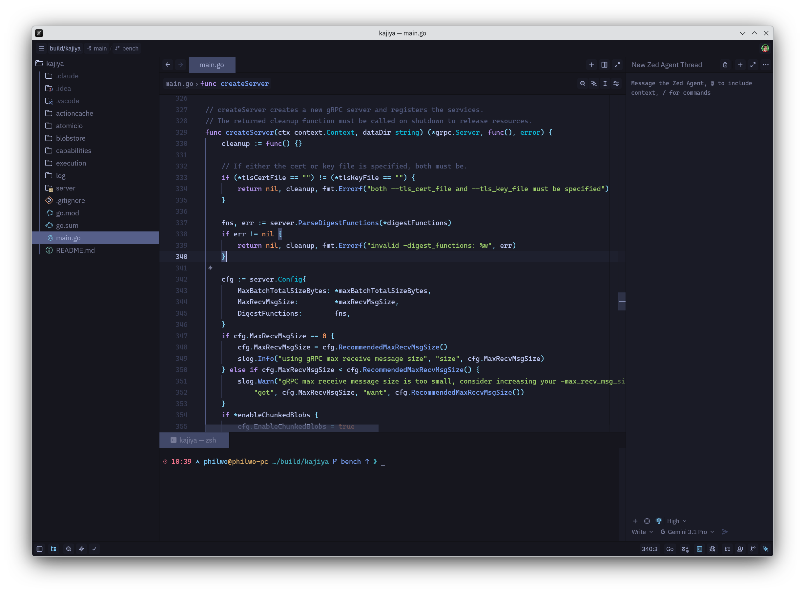
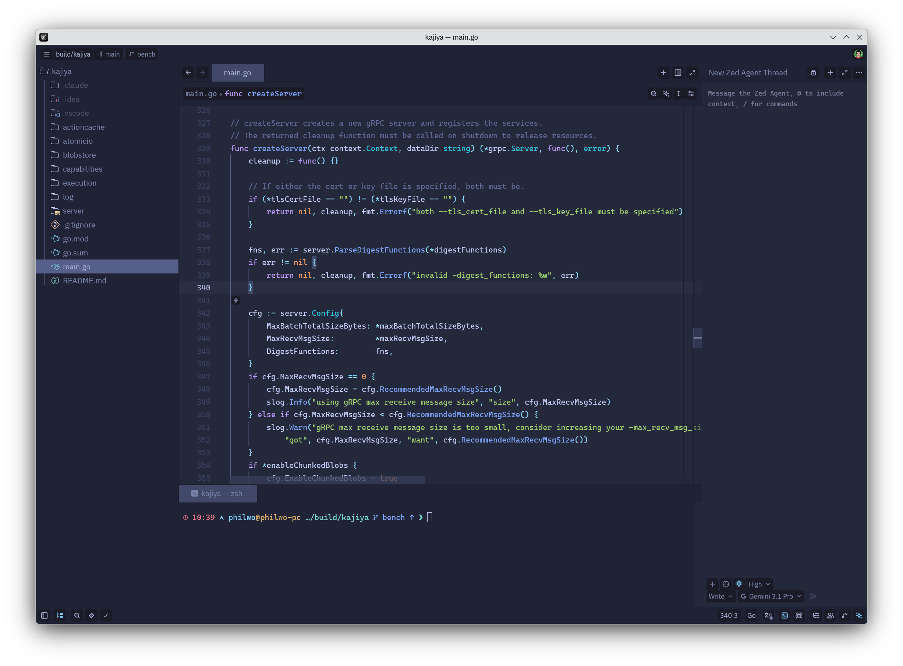
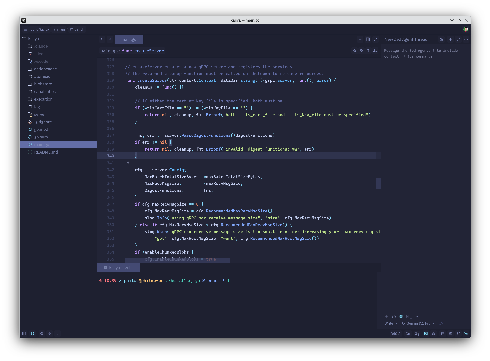
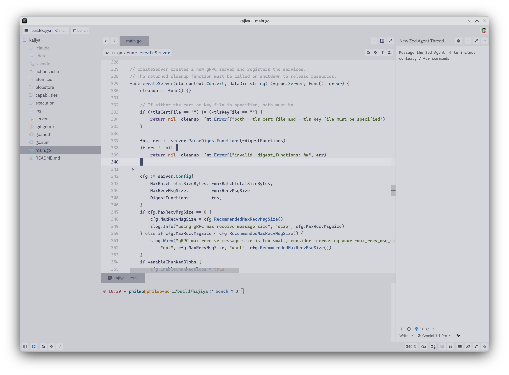

# zed-tokyo-night

Tokyo Night themes for the Zed editor, with four variants: Night,
Storm, Moon, and Light.

This is a fork of
[ssaunderss/zed-tokyo-night](https://github.com/ssaunderss/zed-tokyo-night)
with these changes:

- All variants define the same style keys. Git status colors, indent
  guides, and pane borders no longer fall back to Zed's default theme
  in Storm, Moon, and Light.
- The caret, selection, and all eight collaboration player slots use
  the canonical Tokyo Night palette colors of each variant.
- Terminal foregrounds, dim ANSI colors, whitespace invisibles, and
  focused borders are defined instead of falling back to Zed defaults.
- `scripts/check_variants.py` verifies that the variants stay in sync.

## Install

Zed installs extensions from its official registry, so a fork needs a
dev install:

1. Clone this repository.
2. In Zed, open the command palette and run `zed: install dev extension`.
3. Select the cloned directory.
4. Pick a variant via `theme selector: toggle`.

## Development

After editing `themes/tokyo-night.json`, run:

```sh
python3 scripts/check_variants.py
```

It fails if the variants diverge in style keys, syntax keys, or player
count, or if any value is null or a malformed color.

## Screenshots

### Tokyo Night



### Tokyo Night Storm



### Tokyo Night Moon



### Tokyo Night Light



## Credits

- [enkia/tokyo-night-vscode-theme](https://github.com/enkia/tokyo-night-vscode-theme):
  the original Tokyo Night theme and the Night, Storm, and Light palettes (MIT).
- [folke/tokyonight.nvim](https://github.com/folke/tokyonight.nvim):
  the Moon palette (Apache 2.0).
- [ssaunderss](https://github.com/ssaunderss): the original Zed port (MIT).

See NOTICE for details.
